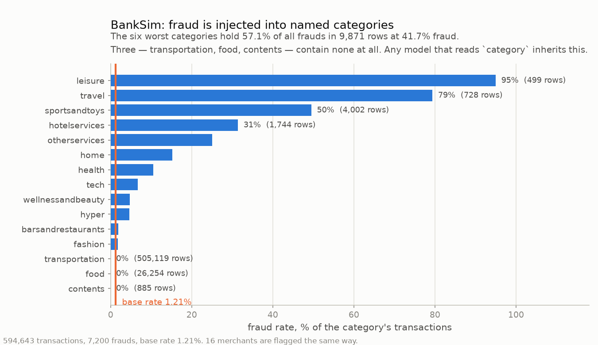

# BankSim — synthetic retail-payment simulator

[kaggle.com/datasets/ealaxi/banksim1](https://www.kaggle.com/datasets/ealaxi/banksim1)
· **CC BY-NC-SA 4.0 (NonCommercial + ShareAlike)** · **fully synthetic**

| | |
|---|---|
| rows / frauds | 594,643 / 7,200 (**1.211%** — the second-highest base rate here) |
| entities | 4,112 customers |
| span | 179 days, **daily** granularity |
| splits | 80.0 / 10.6 / 9.4, temporal |
| columns | 16 |
| delay | median 7d, **8.1% of train labels censored**; 5,551 campaigns, max 35 rows |

**Schema.** `event_time` ← `step` (days since a configured `start_date`) ·
`entity_id` ← `customer` · `amount` ← `amount` · `is_fraud` ← `fraud`.
Passed through: `age`, `gender`, `merchant`, `category`, `zipcodeOri`, `zipMerchant`.

## Artifacts and disclaimers

⚠ **Fraud is injected into named categories.** `es_leisure` runs at 95.0% fraud,
`es_travel` 79.4%, `es_sportsandtoys` 49.5% — against a 1.21% base rate. The six worst
categories hold **57.1% of all frauds**; as a rule they score 0.463 precision / 0.557
recall on test. Three categories contain no fraud at all. 16 merchants are flagged the
same way (`M980657600`: 83.2% fraud, 20.4% of all frauds).

⚠ **`fraud`, the source label column, is passed through** in the canonical frame. Drop
it before fitting.

- **Daily timestamps mean heavy ties** — every transaction on a day shares one
  `event_time`. Splits are cut on timestamp *values* so a tied block never straddles a
  boundary, which is why the ratios land at 80.0/10.6/9.4 rather than exactly 80/10/10.
- Absolute dates are meaningless: `step` is a 0-based day offset anchored to a
  configured date.
- Every string column in the source is wrapped in literal single quotes
  (`"'C1093826151'"`); the adapter strips them.
- `zipcodeOri` and `zipMerchant` are the constant `'28007'` — no information.
- 27 customers are flagged, but none holds more than 2.0% of frauds.
- **NonCommercial**: excluded by `prepare --all --exclude-noncommercial`.
