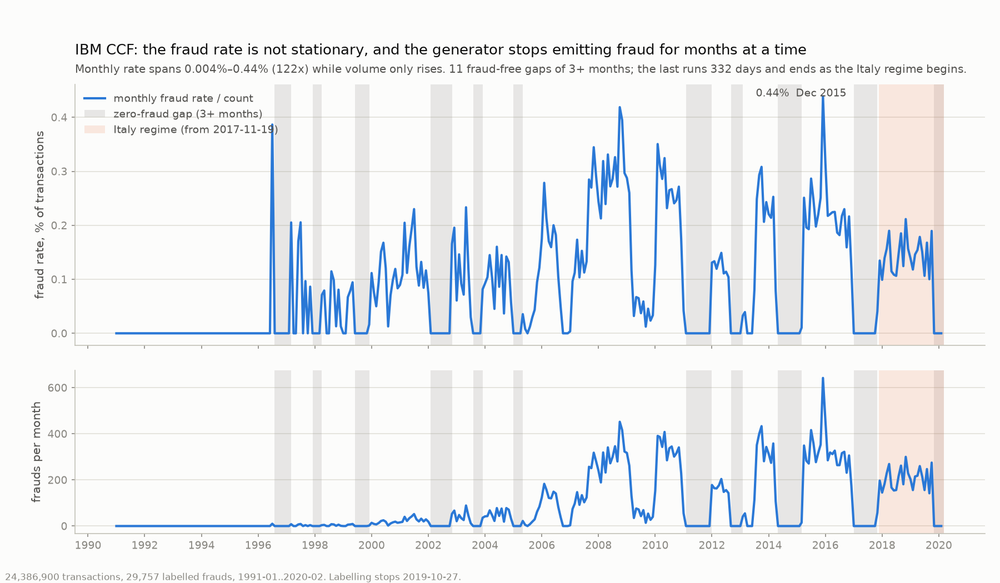

# IBM CCF (Altman) — large synthetic credit-card log

[kaggle.com/datasets/ealtman2019/credit-card-transactions](https://www.kaggle.com/datasets/ealtman2019/credit-card-transactions)
· licence **ambiguous** (see below) · **fully synthetic**

**Read the artifacts before using this dataset for anything.** It is the largest and
most-cited dataset here and its evaluation labels are close to a single categorical
value.

| | |
|---|---|
| rows / frauds | 24,386,900 / 29,757 (**0.122%**) |
| entities | 2,000 users (`entity_key: user`; set to `card` to key per card) |
| span | **29.2 years** (1991-01-02 → 2020-02-28), minute granularity |
| splits | 80 / 10 / 10, temporal |
| columns | 51 — transactions joined to 11 card and 18 user columns |
| delay | median 7d, **0.0% censored** (3 labels of 24,924) — effectively undelayed; 9,769 campaigns |

**Schema.** `event_time` ← `Year`+`Month`+`Day`+`Time` · `entity_id` ← `User` ·
`amount` ← `Amount` · `is_fraud` ← `Is Fraud?`.
Passed through: everything — `Use Chip`, `Merchant Name/City/State`, `Zip`, `MCC`,
`Errors?`, card attributes (`Card Brand/Type`, `Credit Limit`, `Expires`, …) and
cardholder attributes (`FICO Score`, incomes, `Current Age`, `Latitude`/`Longitude`, …).

## Artifacts and disclaimers

⚠⚠ **The fraud generator changes regime in 2017, and the temporal split inherits it.**
Fraud is online/US until 2016 and foreign-merchant afterwards:

| year | ONLINE | US | foreign |
|---|---:|---:|---:|
| 2016 | 3,073 | 506 | 0 |
| 2017 | 0 | 0 | 255 |
| 2019 | 0 | 0 | 2,087 |

So **val frauds are 100% `Merchant State == "Italy"`** and test frauds 94.4%, while
train holds **zero** Italy frauds and is 73.1% online. The one-line rule
`Merchant State == "Italy"`, with no fitting of any kind, scores **F1 0.914 on val and
0.871 on test** — above every model in the ablation (best 0.041 average precision).
This is not a feature to drop and move on from; it is what the evaluation labels *are*.
**Do not publish a headline number on IBM CCF without this caveat.**

⚠ **Foreign is not the artifact; ten countries are.** Of 171 country values, **161 have
zero frauds** across 92,091 rows. Tuvalu 100%, Algeria 96.2%, Haiti 84.1%, Italy 53.6%.
`Merchant City` mirrors it exactly (Rome, Algiers, Port au Prince), so it leaks the same
way — and a merchant id encodes its own location.

⚠ **`MCC` is a second, independent artifact**, not explained by geography: MCC 5732 has
843 frauds at 6.7% (55× base) with **none** in Italy; MCC 4411 is 50.0% fraud over 634
rows. 24 MCC values are flagged.

- **`Is Fraud?` is dropped by the pipeline.** `is_fraud` is the only label in the output;
  the card records the removal in `dropped_source_label`.
- **The tail is labelled, not unlabelled.** `Is Fraud?` has zero nulls across all
  24,386,900 rows. The last fraud is 2019-10-27 and the following 645,180 rows carry
  none — the *generator* stopped emitting fraud. There are also 11 fraud-free gaps of
  three months or more. Crop the tail because it holds no positives, not because labels
  are missing.
- The monthly fraud rate spans 0.003%–2.3% while volume only rises. It is not stationary.
- **Effectively undelayed** — a 7-day delay against a 9,629-day train window censors 3
  labels. IBM CCF cannot exercise a delay-aware method.
- Cardholder details — names, addresses, card numbers, CVVs, `Card on Dark Web` — are
  **fabricated** and describe no real person.
- `sd254_users.csv` has no id column; it is joined **positionally**, its row index being
  the `User` id.
- Money columns arrive as `$`-prefixed strings and are parsed to float.
- Static card and user attributes repeat across every one of a user's rows.
- **Licence:** the dataset description body states Apache-2.0, Kaggle's licence field
  reads CC BY 4.0. Both permit commercial use. Verify upstream before relying on either.
