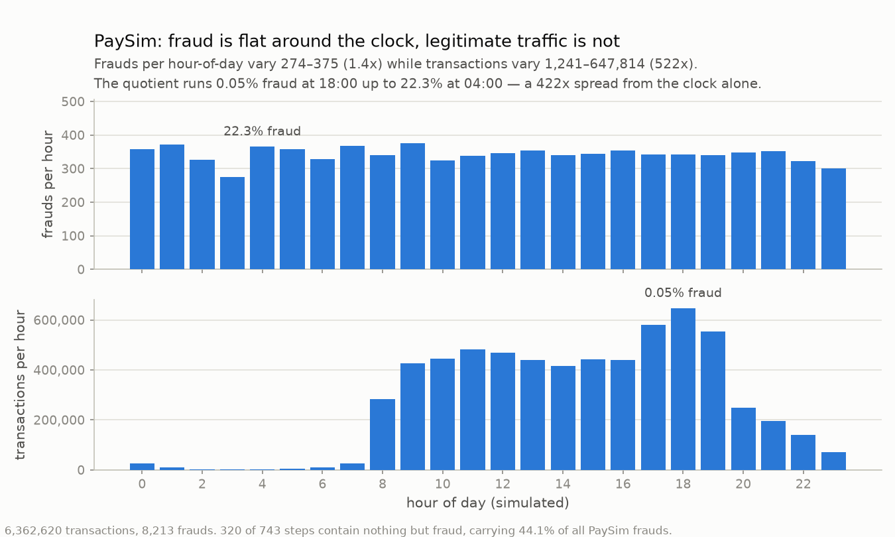

# PaySim — synthetic mobile-money simulator

[kaggle.com/datasets/ealaxi/paysim1](https://www.kaggle.com/datasets/ealaxi/paysim1)
· CC BY-SA 4.0 (**ShareAlike**) · **fully synthetic**

| | |
|---|---|
| rows / frauds | 6,362,620 / 8,213 (**0.129%**) |
| entities | 6,353,307 — `nameOrig` is near-unique per row |
| span | 30 simulated days, hourly granularity |
| splits | 80.4 / 10.1 / 9.5, temporal |
| columns | 17 |
| delay | median 1d, **10.1% of train labels censored**; 8,213 campaigns, all singletons |

**Schema.** `event_time` ← `step` (hours since a configured `start_date`) ·
`entity_id` ← `nameOrig` · `amount` ← `amount` · `is_fraud` ← `isFraud`.
Passed through: `type`, the four balance columns, `nameDest`, `isFlaggedFraud`.

## Artifacts and disclaimers

⚠ **The clock is an oracle.** Fraud is flat across the 24-hour cycle while legitimate
volume swings 522×, so the fraud *rate* varies 422× by hour alone. **320 of 743 steps
contain nothing but fraud** — 44.1% of all PaySim frauds, identifiable from the
timestamp with no model. Holds in every split. Any feature touching hour-of-day
carries this.

⚠ **`type` is a hard gate.** `CASH_IN`, `DEBIT` and `PAYMENT` — 3,592,211 rows, 56.5%
of the dataset — contain **exactly zero** frauds.

⚠ **`isFlaggedFraud` is passed through and must still be dropped before fitting.** It is
the simulator's own detector output, not an input a model would have at scoring time, so
it is in `fraud_benchmark.experiments.columns.ALWAYS_EXCLUDED`. The label column
`isFraud` is a different matter: the pipeline drops it, and the card records that in
`dropped_source_label`.

- `oldbalanceOrg == 10,000,000.0` is 142 rows, all 142 fraud — the simulator's
  balance cap showing through.
- **Campaign grouping does nothing here.** `nameOrig` is near-unique, so every fraud
  is its own campaign and `reported_at` is drawn per row.
- The 30-day span is why the delay is overridden to a 1-day median. That makes the
  dataset usable; it does not make a 30-day clock realistic — see
  [`../label-delay.md`](../label-delay.md).
- Absolute dates are meaningless: `step` is an offset anchored to a configured date.
- ShareAlike — a derived dataset must carry the same licence.
