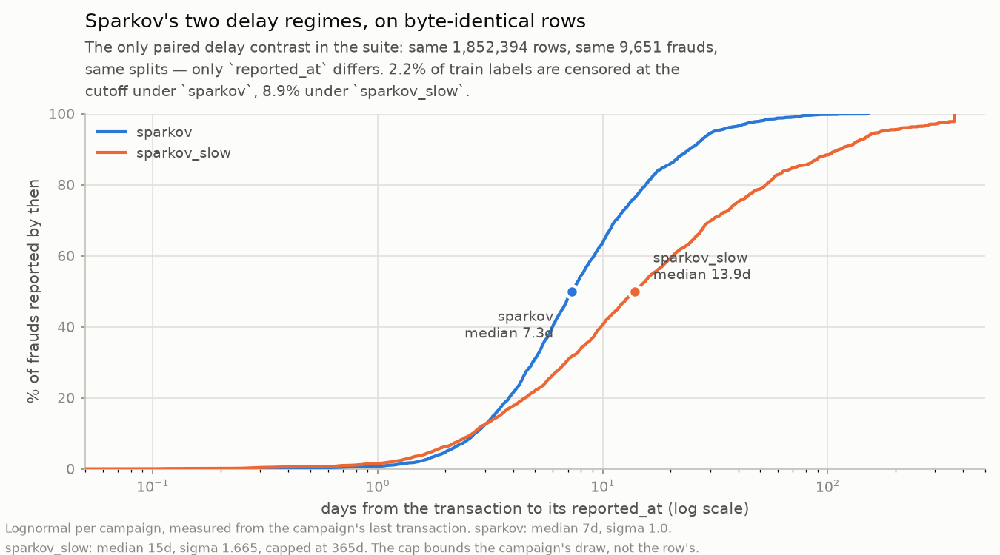

# sparkov_slow — Sparkov under a harsher reporting delay

Not a separate source. **Row-identical to [`sparkov`](sparkov.md) on every column but
`reported_at`**, verified equal on all 28 other columns, and it reuses Sparkov's raw
download rather than fetching again. CC0 1.0.

**It has no feature parquet of its own.** Since the only column that differs is a
timestamp, `experiments/features/sparkov.py` reads this preparation directly and carries
its `reported_at` as `reported_at_slow` in `data/features/sparkov.parquet`, aligned on
`trans_num`. Building it twice would write 173 MB of identical feature columns to express
one differing timestamp. It is still prepared separately — `fraud-benchmark prepare
sparkov_slow` — because this page's censoring figures come from its own dataset card.

Everything on the [`sparkov`](sparkov.md) page applies unchanged — same 1,852,394 rows,
same 9,651 frauds, same 999 cards, same 63/7/30 splits, same artifacts (none), same
`source_file` and `unix_time` hazards. Only the delay differs:

| | `sparkov` | `sparkov_slow` |
|---|---:|---:|
| median | 7d | **15d** |
| sigma | 1.0 | **1.665** |
| cap | — | **365d** |
| train labels censored | 2.2% | **8.9%** |
| observed delay p50 / p95 | 7.3d / 31d | 13.9d / 172d |

**Why it exists.** At the card-fraud default Sparkov's 487-day train window censors only
2.2% of train labels, so the delay barely registers. This regime raises it to 8.9% —
enough for a delay-aware method to have something to work with — **on identical rows**,
which makes it the only paired delay contrast in the suite.

## Artifacts and disclaimers

⚠ **Treat it as a stress test, not a realistic reporting regime.** The 15-day median is
still plausible for a cardholder noticing on a statement, but the tail is deliberately
stretched well past a realistic 60–120 day chargeback window. That tail, not the median,
is what does the censoring: at median 15d with sigma 1.0 it would censor only ~4.5%.

⚠ **Per-row delay can exceed the 365-day cap** — the observed maximum is 367d. The cap
bounds the *campaign's* draw, and a campaign is reported relative to its **last**
transaction, so an earlier row in a multi-day campaign carries the capped delay plus the
campaign's own span. Correct by construction, but it will look like an off-by-something
if you assert `delay <= cap` per row.

- It is a distinct registered dataset, so it prepares to its own
  `data/processed/sparkov_slow/` — 208 MB duplicated on disk for one differing column.
- Do not report `sparkov` and `sparkov_slow` as two datasets in a count of sources.
  There are seven sources; this is an eighth registration.
- Its delay lives in `configs/default.yaml`, not in the adapter.
